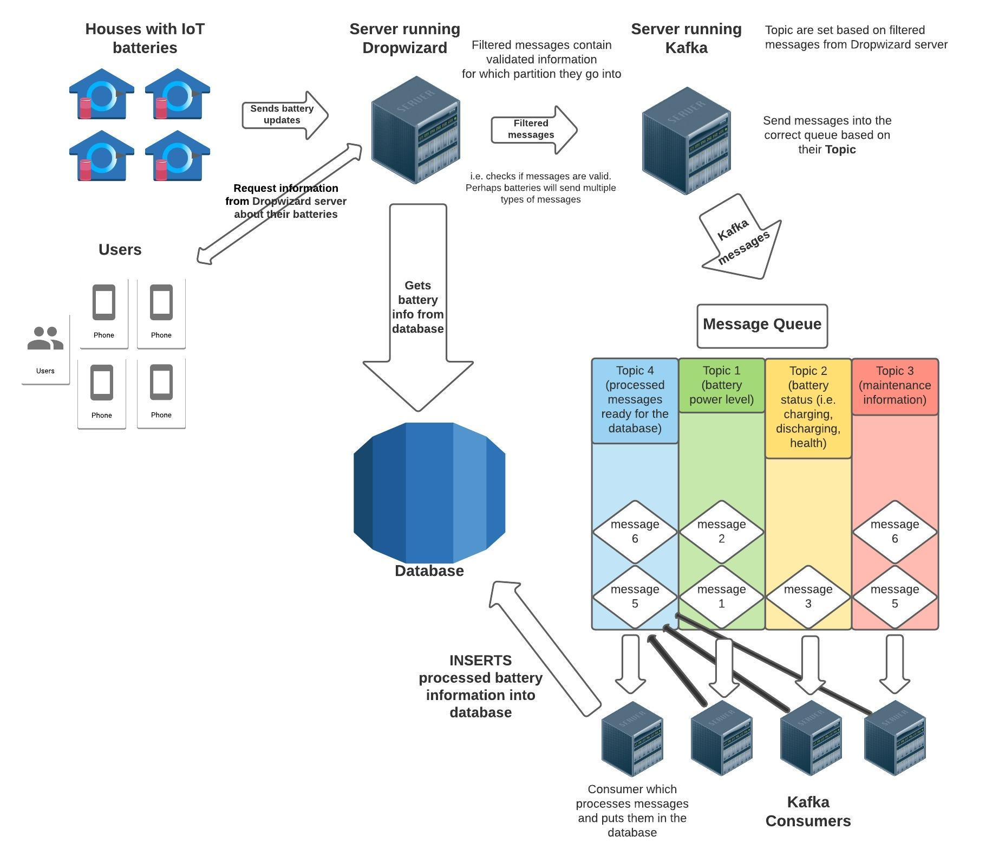

# This is the Energy Resources Project from Manning
Manning Publications provides a problem for us to solve, which begins with
a very basic scaffold. In this project, we create software to handle thousands
of events being generated by distributed, fake battery packs. The original
problem can be found [here.](https://www.manning.com/liveproject/managing-a-distributed-electrical-grid-in-real-time-with-kafka?a_aid=jesse&a_bid=78d8f6d2)

We will solve this problem by making extensive use of Kafka (for handling events)
and Dropwizard for handling all server-related functionality. Each subdirectory's
`README.md` file will contain information related to the code in that directory.

## Overview
Our goal is to build out this infrastructure:

